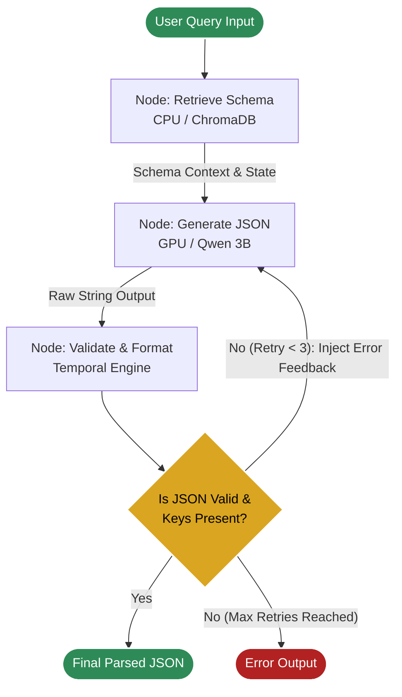

# Welcome to Project VEDA

This is the Repositry contains the final version of VEDA's first layer, along with previous iterations and essential files.
The structure for the repo is:
```
├── benchmark.md
├── chroma_db
│   ├── 46e175ac-afd3-46dd-a0d5-e14c46009ee4
│   │   ├── data_level0.bin
│   │   ├── header.bin
│   │   ├── index_metadata.pickle
│   │   ├── length.bin
│   │   └── link_lists.bin
│   └── chroma.sqlite3
├── columns_homzhub.csv
├── First_version_results.csv
├── First_version_results.md
├── LangGraph_results.csv
├── LangGraph_results.md
├── query_understanding_LG.py
├── query_understanding.py
├── query_understanding_v2.py
├── README.md
├── requirements.txt
└── test_query_understanding.py

```

The final product code is "query_understanding_v2.py".

## Setup and Installation

* Make sure to have Python 3.10+ and a CUDA compatible GPU(recommended 8GB VRAM)
* Run pip install - r requirements.txt and then run "query_understanding_v2.py"
* The repo contains "columns_homzhub.csv" which contains {"table_name","column_name","data_type"} as columns.
To use another schema file, make sure to delete the existing "chrome_db" file and update the file name in the code

## Structure of "query_understanding_v2.py"

The final product is a LangGraph worflow:



The code takes in a string query from the user from the terminal or through a list (For bulk testing, code is commented out for this part). Then the product fetches relevant schema from the preloaded database which is then fetched to the Qwen Model which process a temporary response. This temporary respnose is then passed through a temporal filter to accurately calculate the start and end date (if needed). Then the final output is then validated using Regex, if there is any error in the output the engine is re-run to the Qwen node for upto 3 tries.


The final output is in this JSON format
```
{
    "intent": "str", // SELECT | COUNT | AGGREGATE | TOP_N | SELECT_SUBQUERY
        "temporal_filter": {
            "start_date": "2026-05-08",
            "end_date": "2026-06-07"
        } | null,
        "entities": ["str"], // Retrieved from the Schema database (chroma_db)
        "complexity": "str", // simple | medium | complex
        "needs_clarification": bool,
        "clarification_reason": "str" | null
}
```
## Core Components:

Component | Technology | Description
|---|---|---|
Vector Database | ChromaDB | Stores database schema metadata locally for semantic retrieval.
Embedding Model | BAAI/bge-small-en-v1.5 | Lightweight CPU-bound model mapping user queries to database columns.
Inference Engine | Qwen2.5-Coder-3B-Instruct | GPU-bound model handling reasoning and exact JSON schema generation.
Agentic Framework | LangGraph | Manages state, routes cyclical error-correction, and modularizes node workers.
Hardware Manager | Python threading & gc | Monitors idle time and automatically clears VRAM/CUDA cache after inactivity.

## Key Features

* Lightweight RAG Engine: Prevents Context Window Out-Of-Memory (OOM) errors by using vector search to dynamically inject only the top 15 relevant database schema columns into the SLM prompt.

* Lightweight SLM Model: Provides contextually aware output in a specified format using the provided database Schema.

* Temporal Logic Engine: Translates conversational timeframes (e.g., "last quarter", "rolling 30 days") into exact, mathematical YYYY-MM-DD start and end boundaries.

* VRAM Protection: Employs a background daemon thread that monitors user inactivity and safely terminates the HuggingFace models to free up GPU resources.

* Self-Healing Output: Utilizes cyclical routing. If the LLM generates a broken JSON structure or misses a required key, the pipeline feeds the runtime error back to the model for up to 3 automated correction attempts.

## Benchmarking

The Repo contains "First_version_results.md" and "LangGraph_results.md" which contains a table used for comparing both the versions of the code, to demonstrate the performance of the final code.

* From both the Markdown file, it is evident that the new structure is very much aware of the Database Schema giving very accurate results for entities.

* The execution time for the new code is ~10s more than the first version, this is mainly because of the injection of the vector retrieved Schema which increase the lenth of system_prompt making it slower.

* The temporal_filter is also better and more improved in the new code.


---

Regards,

Manan Jain